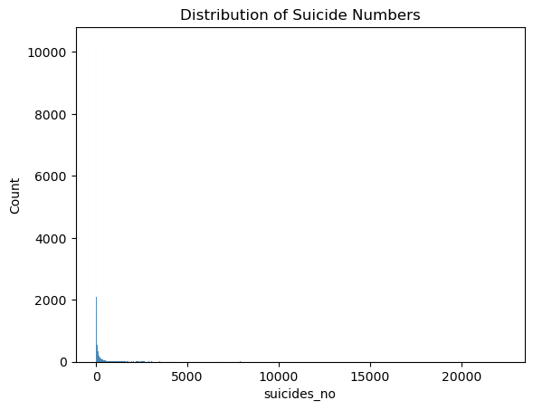
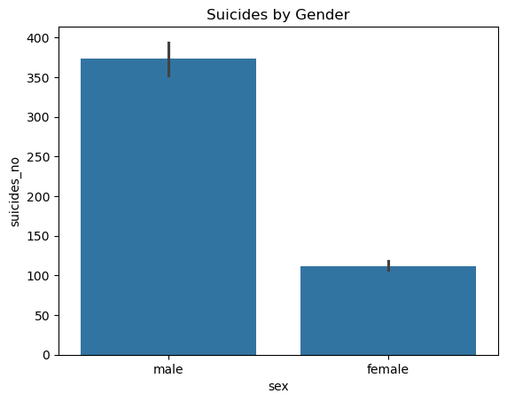
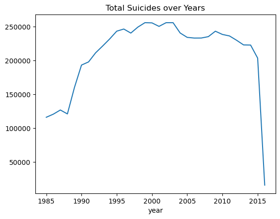
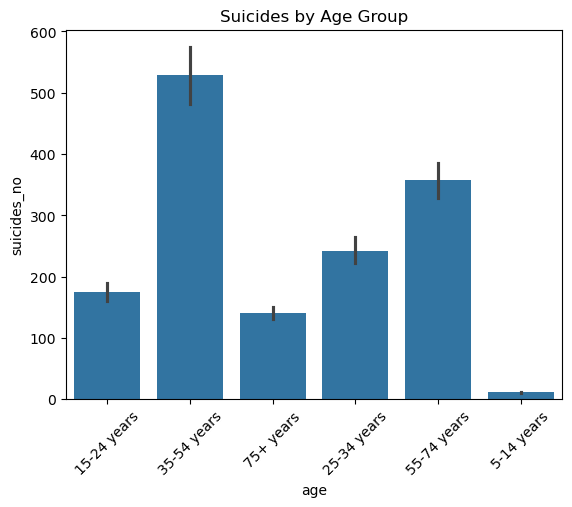
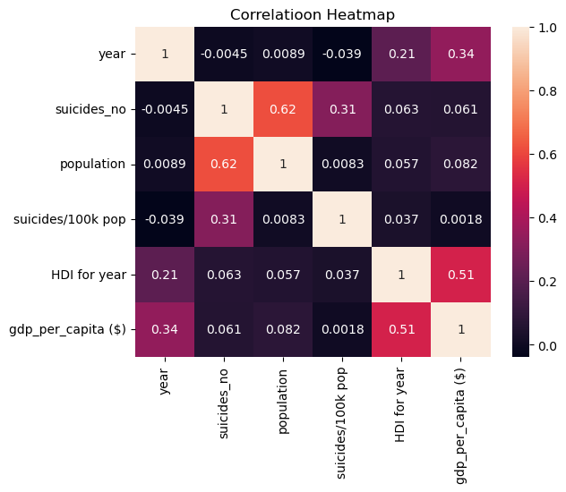
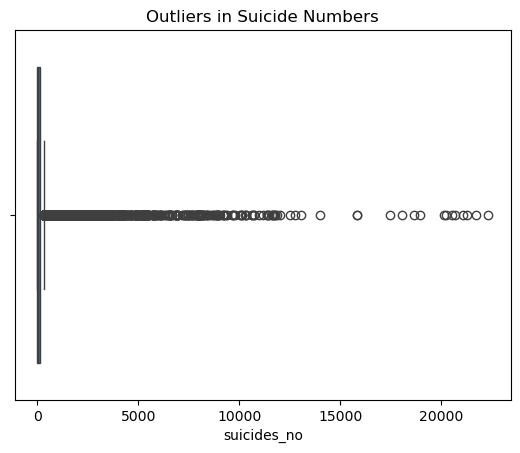

# VAUTECH IT SOLUTIONS – TASK 4

**Intern:** Abhishek Parihar  
**Intern ID:** VT26DS005  
**Domain:** Data Science
**Company:** VAUTECH IT SOLUTIONS  
**Mentor:** Vishal Rajbhar
 
**Task:** Exploratory Data Analysis and Pattern Discovery 
---

## 📌 Objective

The objective of this task is to explore the cleaned suicide dataset and identify patterns, trends, and relationships using data visualization techniques. This helps in understanding the data better before applying any advanced analysis or machine learning.

---

## 🛠 Tools Used

- Python  
- Pandas  
- Matplotlib  
- Seaborn  

---

## 📂 Dataset

- Dataset: Suicide Data (Cleaned)  
- Source:  
  https://raw.githubusercontent.com/MainakRepositor/Datasets/master/Suicide%20data.csv  

---

## 🔍 Exploratory Data Analysis (EDA)

In this task, I performed exploratory data analysis on the cleaned dataset to understand the distribution of variables and relationships between different features.

---

### 📊 1. Distribution of Suicide Numbers
sns.histplot(df['suicides_no'])

### 📊 2. Suicide rate by gender

sns.barplot(x='sex', y='suicides_no', data=df)

### 📊 3. Suicide Trends Over Years

df.groupby('year')['suicides_no'].sum().plot()

### 📊 4. Suicide Cases by Age Group

sns.barplot(x='age', y='suicides_no', data=df)

### 📊 5. Correlation Between Features

sns.heatmap(df.corr(numeric_only=True), annot=True)

### 📊 6. Outlier Detection

sns.boxplot(x=df['suicides_no'])

## Screenshots

### Distribution Plot

### Gender Comparison

### Yearly Trend

### Age Group Analysis

### Correlation Heatmap

### Outlier Detection

## 📊 Key Observations

- Suicide cases vary significantly across different years.

- There is a noticeable difference between male and female suicide counts.

- Certain age groups show higher suicide numbers compared to others.

- Some numerical features show correlation with suicide rates.

- Outliers are present in suicide count data.